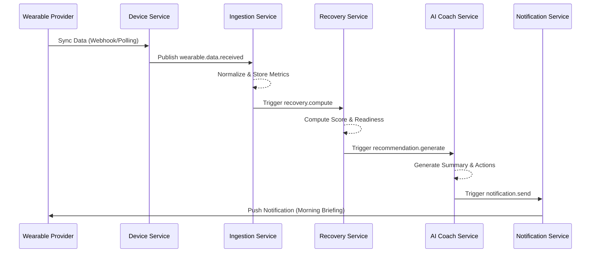

# Architecture & Infrastructure

## System Overview
VitalLens AI is built as a polyglot microservices platform. It leverages **Java Spring Boot** for transactional logic and **Python FastAPI** for AI-driven intelligence.

### Service Map
1.  **API Gateway**: Routing, Auth validation, Rate limiting.
2.  **Auth Service**: JWT-based identity management.
3.  **User Service**: Profile and preference management.
4.  **Device Integration**: Handling wearable data sync.
5.  **Metric Ingestion**: Normalizing time-series biometric data.
6.  **Sleep/Recovery/Strain Services**: Core computation engines.
7.  **AI Coach Service**: LLM-powered natural language reasoning.
8.  **Notification/Alert Services**: Proactive user engagement.

## Event-Driven Architecture
We use **Kafka** to decouple data ingestion from analysis. When wearable data arrives, it triggers a chain of events that eventually updates the user's dashboard.

### Core Flows

#### Daily Sync Sequence

## Infrastructure & Deployment
The platform is designed for containerized deployment using **Docker** and **Kubernetes**.

### Tech Stack
- **Persistence**: PostgreSQL (Transactional), TimescaleDB (Time-series metrics), Redis (Caching/Sessions).
- **Messaging**: Kafka (Event streaming).
- **Orchestration**: Kubernetes (EKS/GKE).
- **Monitoring**: Prometheus, Grafana, OpenTelemetry.

### Local Development
A `docker-compose.yml` file is provided in the `infra/` directory to spin up the local environment, including:
- PostgreSQL 15
- Kafka (KRaft mode)
- Redis 7
- AI Service (Python/FastAPI)
- Core Java Services
